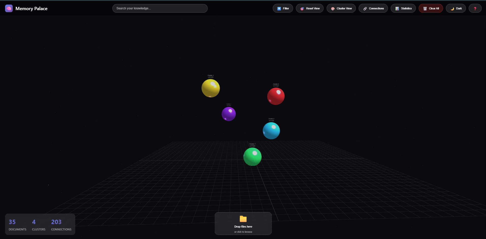
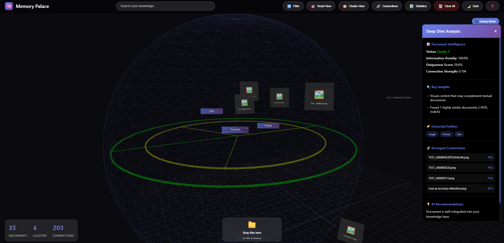

# Memory Palace 3D 🧠✨

**Transform your documents into a navigable 3D knowledge universe using AI-powered spatial organization**

[](https://qdrant.tech/)
[](https://threejs.org/)
[](https://fastapi.tiangolo.com/)

## 🎥 Demo Video
[Watch the demo video](https://youtu.be/your-video-id)

## 🚀 Overview

Memory Palace 3D revolutionizes document management by transforming your files into an interactive 3D space where similar documents cluster together naturally. Using advanced vector embeddings and spatial visualization, it creates a living knowledge graph you can explore intuitively.

### ✨ Key Features

- **🌌 3D Spatial Navigation** - Fly through your documents in an immersive 3D environment
- **🧲 Smart Clustering** - Documents automatically organize by semantic similarity using KMeans clustering
- **🔍 Deep Dive Analysis** - Click any document to reveal connections, key concepts, and visual previews
- **🖼️ Visual Intelligence** - Image previews and thumbnails for connected documents
- **⚡ Real-time Search** - Semantic search powered by Qdrant vector database
- **🎨 Beautiful Visualizations** - Particle effects, connection lines, and smooth animations

## 🛠️ Tech Stack

- **Frontend**: Three.js, WebGL, Vanilla JavaScript
- **Backend**: FastAPI, Python 3.8+
- **Vector Database**: Qdrant
- **AI/ML**: OpenAI Embeddings (text-embedding-3-small), KMeans Clustering
- **Processing**: PyPDF2, Pillow, python-docx

## 📋 Prerequisites

- Python 3.8+
- Docker (for Qdrant)
- OpenAI API key

## 🔧 Installation

### 1. Clone the repository
```bash
git clone https://github.com/DavaughnHoots/quant-memory-palace.git
cd quant-memory-palace/memory-palace-hackathon
```

### 2. Set up Qdrant
```bash
docker run -p 6333:6333 -v $(pwd)/qdrant_storage:/qdrant/storage qdrant/qdrant
```

### 3. Install Python dependencies
```bash
cd backend
pip install -r requirements.txt
```

### 4. Configure environment
Create a `.env` file in the backend directory:
```env
OPENAI_API_KEY=your-api-key-here
QDRANT_URL=http://localhost:6333
```

### 5. Run the application

#### Option 1: Use the universal startup script (Recommended)
```bash
python RUN_MEMORY_PALACE.py
```

#### Option 2: Platform-specific scripts
- **Windows**: Double-click `START.bat`
- **Linux/Mac**: Run `./start.sh`

#### Option 3: Run manually
```bash
# Terminal 1 - Backend
cd backend
python -m uvicorn main:app --host 0.0.0.0 --port 8000 --reload

# Terminal 2 - Frontend
cd frontend
python -m http.server 3000
```

Navigate to `http://localhost:3000`

## 🎮 Usage

1. **Upload Documents**: Drag and drop or click to upload PDFs, images, text files
2. **Explore**: Use mouse to navigate the 3D space
   - Left click + drag: Rotate view
   - Right click + drag: Pan
   - Scroll: Zoom in/out
3. **Interact**:
   - Click cluster centers to expand document groups
   - Click documents to activate Deep Dive mode
   - Use search to find specific content
4. **Analyze**: Deep Dive reveals:
   - Related documents with similarity scores
   - Key concepts and entities
   - Visual previews for images
   - AI-generated insights

## 🏗️ Architecture

```
memory-palace-hackathon/
├── backend/
│   ├── main.py              # FastAPI application
│   ├── services/
│   │   ├── qdrant_service.py    # Vector database operations
│   │   ├── embedding_service.py # OpenAI embeddings
│   │   ├── file_processor.py    # Document processing
│   │   └── clustering.py        # Spatial organization
│   ├── models/
│   │   └── schemas.py       # Data models
│   ├── uploads/             # Stored images for previews
│   └── requirements.txt     # Python dependencies
├── frontend/
│   ├── index.html
│   ├── js/
│   │   ├── scene.js         # 3D scene management
│   │   ├── deepdive.js      # Deep analysis mode
│   │   ├── api.js           # Backend communication
│   │   └── controls.js      # User controls
│   └── css/
│       ├── styles.css       # Main styling
│       └── deepdive.css     # Deep dive panel styling
├── RUN_MEMORY_PALACE.py     # Universal startup script
├── START.bat                # Windows startup
└── start.sh                 # Linux/Mac startup
```

## 🔬 How It Works

1. **Document Processing**: Files are processed to extract text content
2. **Embedding Generation**: Content is converted to high-dimensional vectors using OpenAI
3. **Clustering**: KMeans groups similar documents into semantic clusters
4. **3D Positioning**: UMAP reduces dimensions for spatial visualization
5. **Real-time Rendering**: Three.js renders the interactive 3D environment
6. **Similarity Search**: Qdrant enables lightning-fast nearest neighbor queries

## 🎯 Use Cases

- **Research**: Explore connections between academic papers
- **Knowledge Management**: Organize company documentation
- **Creative Projects**: Discover patterns in creative works
- **Learning**: Build visual knowledge maps for studying
- **Digital Archives**: Navigate large collections intuitively

## 📸 Screenshots


*Documents organized in 3D space with automatic clustering*


*Deep dive panel showing document connections and insights*

## 🚧 Known Issues & Roadmap

### Current Limitations
- Large collections (>500 docs) may impact performance
- Image preview generation requires backend restart for existing documents

### Future Enhancements
- [ ] PDF thumbnail generation
- [ ] Collaborative spaces
- [ ] Export knowledge graphs
- [ ] Custom embedding models
- [ ] VR/AR support
- [ ] Document annotations
- [ ] Time-based visualization

## 🤝 Contributing

Contributions are welcome! Please feel free to submit a Pull Request.

1. Fork the repository
2. Create your feature branch (`git checkout -b feature/AmazingFeature`)
3. Commit your changes (`git commit -m 'Add some AmazingFeature'`)
4. Push to the branch (`git push origin feature/AmazingFeature`)
5. Open a Pull Request

## 📄 License

MIT License - see [LICENSE](LICENSE) file for details

## 🏆 Acknowledgments

- Built for the **Qdrant Hackathon 2024**
- Inspired by spatial memory techniques and the Method of Loci
- Thanks to the Qdrant team for the powerful vector database
- Three.js community for amazing 3D visualization tools

## 📧 Contact

**Davaughn Hoots**

Project Link: [https://github.com/DavaughnHoots/quant-memory-palace](https://github.com/DavaughnHoots/quant-memory-palace)

---

**⭐ If you find this project useful, please consider giving it a star!**